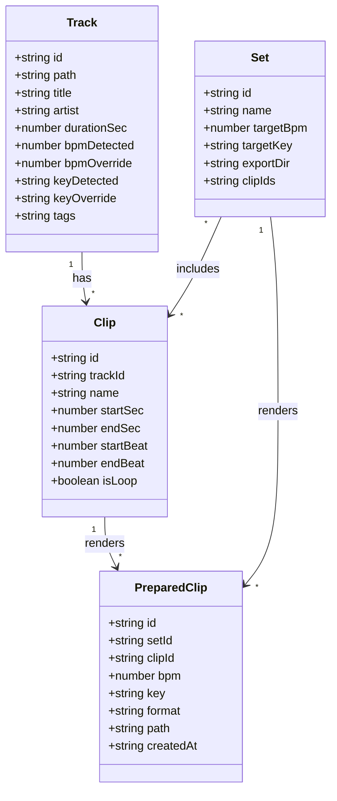

# Loop Library (Strudel Clip Prep)

This project helps you prepare **clips** from music tracks for use in **Strudel** live coding sets.

## Goals

- Manage a local track library (filesystem-based)
- Create named **clips** (one-shots or loopable regions) from tracks
- Prepare (time/pitch adjust) clips to match a Strudel set’s target BPM/key
- Export a set folder with **PreparedClips** ready for Strudel

## Dev/Run Modes (current architecture)

- **Browser dev mode**: Electron runs the local API server; the UI runs in a normal browser via Vite.
  - UI: `http://localhost:5173`
  - API: `http://127.0.0.1:3123` (Vite proxies `/api` to this)
- **Electron window mode**: Express serves the built UI and Electron opens a window pointing at the API URL.

## Object Model (proposed)

### Core objects

- **Track**: a source audio file in your library + metadata/analysis.
- **Clip**: a named region of a track (a “thing you trigger” in Strudel).
  - Clips can be **loopable** or **one-shot**.
  - Looping is ultimately a Strudel pattern concern; this flag helps UX + export + helper generation.
- **Set**: a Strudel “project context” with target BPM/key and chosen clips.
- **PreparedClip**: a rendered output for a **specific set** derived from a clip (tempo/key/format adjusted) and written to that set’s export folder.

### Relationships diagram

## Persistence (JSON files)

Stored in an app data directory (not in the repo), loaded into memory at startup and written back on change:

- `settings.json`
- `tracks.json`
- `clips.json`
- `sets.json`
- (optional later) `preparedClips.json` (or embed under sets)

Audio files are stored on disk; JSON stores paths and metadata.
